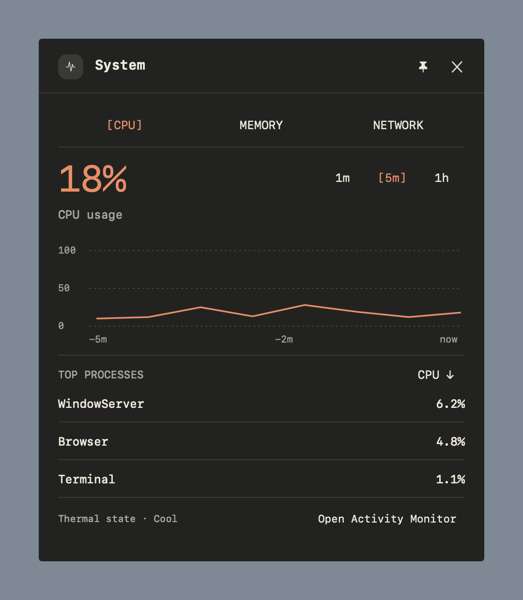

# ConstellationBar

A native macOS workspace and status bar. Keep workspaces, music, calendar and system widgets within reach, with a different layout on every display. Built with Swift and AppKit.

**[Download the notarized 0.5.0 alpha](https://github.com/edrenck/constellation-bar/releases/download/v0.5.0/ConstellationBar-0.5.0-universal.zip)** · [Release notes and checksums](https://github.com/edrenck/constellation-bar/releases/tag/v0.5.0) · [Report a bug](https://github.com/edrenck/constellation-bar/issues/new?template=bug_report.md)


## Install

1. Download the ZIP above, extract it and move **ConstellationBar.app** to **Applications**.
2. Open the app. The configuration window opens on first launch.
3. Choose your widgets and appearance. Use **Customize Bar…** from the menu-bar icon to return to settings.

The download is Developer ID signed, Apple-notarized and stapled. It targets **macOS 14+** and contains **Apple Silicon and Intel** binaries. Runtime testing so far covers macOS 27 on Apple Silicon; Intel, older macOS versions and physical multi-monitor setups need alpha feedback. AeroSpace is optional; Standalone mode provides the active app and widgets without it.

See [installation, updates and removal](docs/INSTALLATION.md) for checksum verification and troubleshooting. Updates are manual in this alpha.

## Make it yours

- **Three layouts:** Rail, Islands and Compact, with overflow menus and widget reordering.
- **Five appearances:** Cove, Typeset, Porcelain, Native Glass and Native Studio. Native materials follow system light/dark mode, with fallbacks on older macOS versions.
- **Independent displays:** choose each monitor’s widgets, order, edge position and workspace buttons. Put widgets in the center of a wide screen while keeping others at its edge.
- **Interactive panels:** hover to look and click to pin Music, Calendar, Audio, VPN or System details.
- **Workspaces:** connect AeroSpace to switch workspaces and preview their application cards without Screen Recording access.

Built-in widgets include battery, clock, network, CPU and memory, disk, uptime, thermal pressure, weather, media and experimental Codex activity. Provider availability depends on your Mac and enabled integrations. See [widget capabilities and setup](docs/WIDGETS.md).



## Set up multiple monitors

Open **Customize Bar → Application → Display overrides** and select a display. Turn off **Use global widgets**, then assign widgets to **Edge**, **Center** or **Hidden**. Reorder each group with the arrow controls and choose which side holds the edge group.

Choose **Local**, **All**, **Selected** or **Hidden** workspace buttons for that display. Selected workspace IDs control what the bar shows; AeroSpace still manages workspace ownership. Settings for disconnected displays remain saved.

See the [configuration reference](docs/CONFIGURATION.md) for examples, defaults and validation rules. You can import/export settings in Application. The default configuration path is `~/.config/constellation-bar/config.json`.

## Privacy

The app collects no telemetry. Calendar access and Apple Music automation are opt-in. Weather sends configured coordinates to [Open-Meteo](https://open-meteo.com/) only when enabled. The optional browser companion and Codex integration are experimental; see [integration details](docs/WIDGETS.md) before enabling them.

## Build and contribute

Building requires Xcode 26.1 or later with the macOS 26 SDK. The app’s deployment target remains macOS 14.

```sh
git clone https://github.com/edrenck/constellation-bar.git
cd constellation-bar
./scripts/build-app.sh
open .build/ConstellationBar.app
```

Use `./scripts/build-app.sh --universal` for both architectures. Local development builds are ad-hoc signed. Run `swift test` for the Swift tests; see [Contributing](CONTRIBUTING.md) and [Architecture](docs/ARCHITECTURE.md) for development guidance.

For immediate AeroSpace updates, merge the [example callbacks](examples/aerospace-callbacks.toml) into your existing AeroSpace configuration. Polling also works without callbacks.

## Website and license

The product website has its own repository: [constellation-bar-website](https://github.com/edrenck/constellation-bar-website), including the HTML/CSS source, assets and static export instructions.

[MIT licensed](LICENSE). See [third-party notices](THIRD_PARTY_NOTICES.md) and the [changelog](CHANGELOG.md).
