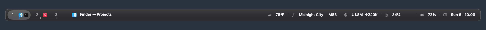

# ConstellationBar

A native macOS workspace and status bar. Connect AeroSpace, arrange your modules, and choose a composition that fits your desktop. Written in Swift and AppKit, with no third-party runtime dependencies.

## Three compositions

- **Rail** — one quiet surface, connected workspace nodes, restrained status icons.
- **Islands** — separate floating groups for workspaces, active app, and status.
- **Compact** — workspace controls and an icon-first status strip.

Each layout supports status on either side, widget reordering, overflow menus, light/dark palettes, native materials, and display-specific overrides. Hover over a widget to open its panel; click to pin that same panel open. Workspace previews use application cards and require no Screen Recording permission.



## Alpha status

The public alpha is in preparation; there is no public download yet. See [release gates and two-display setup](docs/ALPHA.md), [installation/upgrade/removal](docs/INSTALLATION.md), and [changelog](CHANGELOG.md).

## Requirements and installation

- macOS 14 or later. Universal builds include Apple Silicon and Intel binaries.
- AeroSpace is optional. Automatic mode discovers its CLI; if it is unavailable, the bar shows the active app and system widgets. Standalone mode disables AeroSpace integration entirely.
- Building requires Xcode 26.1 or later with the macOS 26 SDK. The deployment target remains macOS 14; older systems use fallback materials.

```sh
./scripts/build-app.sh
open .build/ConstellationBar.app
```

For a universal build:

```sh
./scripts/build-app.sh --universal
```

Move the built app to `/Applications` before enabling Launch at Login. The first launch opens the configuration window. Fresh installations start with the Rail layout, battery (when present), and the clock. Weather and media automation are opt-in.

Local builds are ad-hoc signed. Developer ID signing and notarization for public downloads are described in [Releasing](docs/RELEASING.md). The release workflow creates a **draft**, not an automatically published release.

For development:

```sh
./scripts/run.sh --configure
swift test
```

Scripts respect the selected toolchain and `DEVELOPER_DIR`. If your selected Command Line Tools are mismatched, select a compatible toolchain or set `DEVELOPER_DIR` explicitly; no developer-specific path is baked into the scripts.

## Make it yours

Choose **Customize Bar…** from the menu-bar icon:

- **Layout:** Rail, Islands, or Compact; left/right placement; module order with keyboard-accessible controls.
- **Widgets:** visibility, graph options, media idle behavior, weather coordinates and units. Click a module in the preview to jump to its options.
- **Appearance:** palettes, accent, density, material, contrast, and indicators.
- **Connections:** workspace provider, optional executable override, preferred workspace order, diagnostics.
- **Application:** login startup, display behavior, per-display layout overrides, configuration import/export. Choose a display to set its Edge and Center widget groups, ordering, and local/all/selected/hidden workspace buttons.

Discovered workspaces always remain available. A preferred list only controls ordering. Use `workspaceAliases` in the JSON configuration to give workspace IDs display labels. Narrow layouts preserve workspace access through an overflow menu.

Built-in widgets: battery, VPN, network, System (CPU and memory), Agent Status (Codex), disk, uptime, thermal pressure, clock, Apple Music playback, and weather. VPN discovery enumerates configured macOS network services; Tailscale adds optional CLI controls. Some third-party VPNs are not exposed by macOS network-service enumeration.

## Configuration

The app reads configuration in this order:

1. `--config /path/to/config.json`
2. `CONSTELLATION_CONFIG`
3. `~/.config/constellation-bar/config.json`
4. `./constellation-bar.json` during command-line development only
5. Built-in portable defaults

The app never loads a personal configuration from its bundle. Saving creates a `.backup` file before the first rewrite. Older files migrate to schema version 3 when saved, retaining the previous Islands layout and personal settings. Invalid or unsupported files produce an error and are not overwritten.

Start from [minimal](examples/minimal.json), [performance](examples/performance.json), or [standalone](examples/standalone.json). See the [configuration reference](docs/CONFIGURATION.md) for display overrides and validation limits.

## AeroSpace refresh callbacks

Polling remains available for installations without callbacks. For immediate focus/workspace updates, merge the example callbacks in [aerospace-callbacks.toml](examples/aerospace-callbacks.toml) into your existing AeroSpace configuration. On `SIGUSR1` and app activation, a dedicated focused-workspace query updates selection before the full window inventory finishes. The app also refreshes after waking. With callbacks installed, a 3–10 second polling interval is usually sufficient as a recovery fallback.

References: [AeroSpace callbacks](https://nikitabobko.github.io/AeroSpace/guide), [workspace output fields](https://nikitabobko.github.io/AeroSpace/commands#list-workspaces).

## Contributing

See [CONTRIBUTING.md](CONTRIBUTING.md) and the [module architecture](docs/ARCHITECTURE.md). Providers, widget presentations, layout geometry, and AppKit views are separate. Third-party binary plugins and a script-widget protocol are future work; the current extension point is compiled Swift modules.

MIT licensed, including commercial use. See [licensing and future paid offerings](docs/LICENSING.md) and [third-party notices](THIRD_PARTY_NOTICES.md). Weather is provided by [Open-Meteo](https://open-meteo.com/) and is requested only when configured and enabled. Apple Music access uses macOS Automation permission. No telemetry is collected.


### Five appearances

Choose **Cove**, **Typeset**, **Porcelain**, **Native Glass**, or **Native Studio** in Customize Bar → Appearance. Each works with Rail, Islands and Compact and styles the inspectors too. Native appearances follow system light/dark mode and use Liquid Glass on macOS 26+ with a vibrancy fallback on 14/15. Custom appearances use coordinated opaque palettes. Configuration v3 migrates older files while preserving layout and module settings.

Run `swift run ConstellationBar --render-previews .build/appearance-previews` for the appearance/layout matrix, narrow widths, notch exclusions, light/dark native variants and settings captures. Native appearance bitmaps use the opaque accessibility fallback because offscreen bitmaps cannot reproduce the compositor's live Liquid Glass optics; verify those in the running app.

## Interactive widgets

Media, Calendar, VPN, Audio and System now have interactive panels, with independent provider options and capability-aware controls. Apple Music and the optional browser companion are the initial media providers; native Spotify is marked for later. Read [widget capabilities and setup](docs/WIDGETS.md) before enabling integrations.

## Product website

The complete website source is in [`website/`](website/README.md). `npm ci` and `npm run build` in that folder produce a portable `dist/client/` directory with HTML, CSS, JavaScript and images for your own subdomain or static host. CI builds a downloadable website artifact; it does not deploy it.
