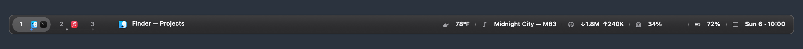
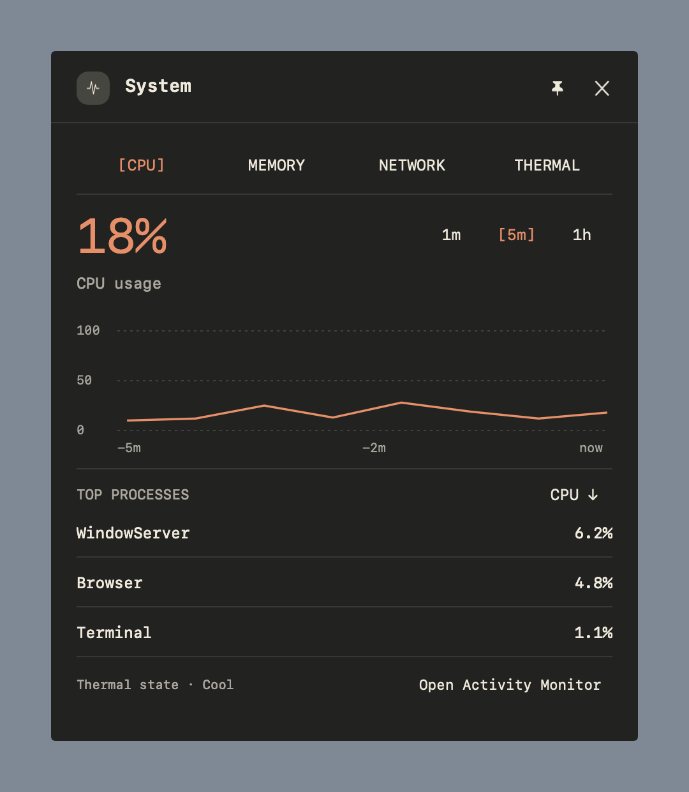

# ConstellationBar

A native macOS workspace and status bar. Keep workspaces, music, calendar and system widgets within reach, with a different layout on every display. Built with Swift and AppKit.

**[Download the notarized 0.5.0 alpha](https://github.com/edrenck/constellation-bar/releases/download/v0.5.0/ConstellationBar-0.5.0-universal.zip)** · [Release notes and checksums](https://github.com/edrenck/constellation-bar/releases/tag/v0.5.0) · [Report a bug](https://github.com/edrenck/constellation-bar/issues/new?template=bug_report.md)



## Install

1. Download the ZIP above, extract it and move **ConstellationBar.app** to **Applications**.
2. Open the app. The configuration window opens on first launch.
3. Choose your widgets and appearance. Use **Customize Bar…** from the menu-bar icon to return to settings.

The download is Developer ID signed, Apple-notarized and stapled. It targets **macOS 14+** and contains **Apple Silicon and Intel** binaries. Runtime testing so far covers macOS 27 on Apple Silicon; Intel, older macOS versions and physical multi-monitor setups need alpha feedback. AeroSpace is optional; Standalone mode provides the active app and widgets without it.

See [installation, updates and removal](docs/INSTALLATION.md) for checksum verification and troubleshooting. Updates are manual in this alpha.

## Make it yours

- **Three layouts:** Rail, Islands and Compact, with overflow menus and widget reordering.
- **Five appearances:** Cove, Typeset, Porcelain, Native Glass and Native Studio. Native materials follow system light/dark mode, with fallbacks on older macOS versions.
- **Independent displays:** choose each monitor’s widgets, order, edge position and workspace buttons. Put widgets in the center of a wide screen while keeping others at its edge.
- **Interactive panels:** hover to look and click to pin Music, Calendar, Audio, VPN or System details.
- **Workspaces:** connect AeroSpace to switch workspaces and preview their application cards without Screen Recording access.

Built-in widgets include battery, clock, network, CPU and memory, disk, uptime, thermal pressure, weather, media and experimental Codex activity. Provider availability depends on your Mac and enabled integrations. See [widget capabilities and setup](docs/WIDGETS.md).



## Set up multiple monitors

Open **Customize Bar → Application → Display overrides** and select a display. Turn off **Use global widgets**, then assign widgets to **Edge**, **Center** or **Hidden**. Reorder each group with the arrow controls and choose which side holds the edge group.

Choose **Local**, **All**, **Selected** or **Hidden** workspace buttons for that display. Selected workspace IDs control what the bar shows; AeroSpace still manages workspace ownership. Settings for disconnected displays remain saved.

See the [configuration reference](docs/CONFIGURATION.md) for examples, defaults and validation rules. You can import/export settings in Application. The default configuration path is `~/.config/constellation-bar/config.json`.

## Privacy

The app collects no telemetry. Calendar access is opt-in. Music uses macOS Now Playing without a browser extension. Weather sends configured coordinates to [Open-Meteo](https://open-meteo.com/) only when enabled. The native media adapter and Codex integration are experimental; see [integration details](docs/WIDGETS.md) before enabling them.

## Build and contribute

Building requires Xcode 26.1 or later with the macOS 26 SDK. The app’s deployment target remains macOS 14.

```sh
git clone https://github.com/edrenck/constellation-bar.git
cd constellation-bar
./scripts/build-app.sh
open .build/ConstellationBar.app
```

Use `./scripts/build-app.sh --universal` for both architectures. Local development builds are ad-hoc signed. Run `swift test` for the Swift tests; see [Contributing](CONTRIBUTING.md) and [Architecture](docs/ARCHITECTURE.md) for development guidance.

For immediate AeroSpace updates, merge the [example callbacks](examples/aerospace-callbacks.toml) into your existing AeroSpace configuration. Polling also works without callbacks.

## Website and license

The product website has its own repository: [constellation-bar-website](https://github.com/edrenck/constellation-bar-website), including the HTML/CSS source, assets and static export instructions.

[MIT licensed](LICENSE). See [third-party notices](THIRD_PARTY_NOTICES.md) and the [changelog](CHANGELOG.md).

### Configuration organization

The configuration window uses a sidebar and applies changes immediately to the native bar.

- **Displays:** shared bar shape and alignment, display selection, and per-display widget zones and overrides.
- **Widgets:** default visibility and shared options such as date format, music behavior, and weather location.
- **Appearance:** shared theme, color mode, density, and appearance reset.
- **Workspaces:** workspace source, AeroSpace path, ordering, and app icons.
- **Connections:** data providers for widgets.
- **Application:** launch at login, refresh interval, and configuration import/export.
- **Diagnostics:** integration status and configuration file location.

Display overrides take precedence over shared defaults. Use “Reset this display to global settings” to restore inheritance. Undo remains available in the sidebar for configuration edits made during this session.

### 0.7 display sizing and local Outlook calendars

In **Layout → Per-display setup**, choose the monitor and set **Bar size**. Automatic retains the built-in display’s physical calibration and gives external displays a readable minimum logical size. For a large 4K monitor viewed farther away, try 125% or 150%. Changes are saved for that display, including when disconnected. Reset restores automatic sizing.

In **Connections → Calendar → Provider**, choose **Apple Calendar** or **Outlook for Mac**. Apple Calendar remains the default. For Outlook, open the Calendar widget and select **Choose Outlook data folder**. Select `~/Library/Group Containers/UBF8T346G9.Office/Outlook`. ConstellationBar stores a read-only, security-scoped folder bookmark; **Connections → Outlook local access → Disconnect Outlook folder** removes it.

The Outlook provider reads local cached calendar records without Microsoft sign-in, credentials, event edits, or calendar-server requests. Outlook itself handles synchronization. Keep Outlook up to date and open it to refresh its cache. The bar rereads the cache approximately every 15 seconds, showing the past week and next three weeks. Choose which calendars appear using the calendar panel’s gear button. **Open in Outlook** opens the local app.

The cache adapter is verified with Outlook 16.112.4 and its Gmail calendars. It follows the checksummed active storage directory, excluding abandoned versions and deleted records. Cached recurring occurrences retain their individual dates. Only the supported Nostromo-i calendar schema is decoded; an incompatible or changing cache displays a status message instead of guessing. The current adapter displays titles, calendar names, times, and all-day events; locations, attendees, and meeting links are not yet decoded from this cache. A legacy Automation fallback remains available when that interface already exposes calendar events.
